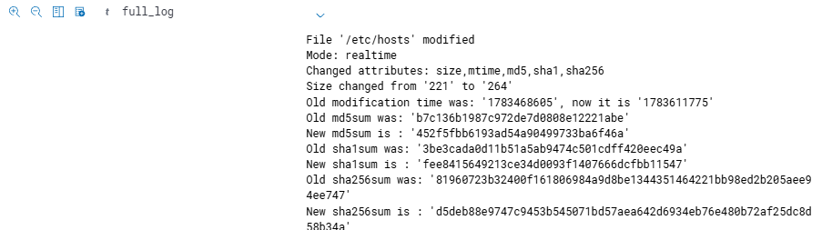

## Session 2: File Integrity Monitoring and Detecting Persistence

At this point I had already brute forced the victim (`192.168.56.103`) and I know the root password, so the machine is under my attack machine's control. In this session I wanted to see what happens next: an attacker who has access will usually try to keep it, and I wanted to watch Wazuh's File Integrity Monitoring (FIM) catch that. This maps to **MITRE T1136 (Create Account)**.

### Setting up real-time FIM

I configured FIM (Wazuh's `syscheck` module) on the victim to watch `/etc` in real time so any change to those files is caught as it happens:

```xml
<directories realtime="yes" check_all="yes" report_changes="yes">/etc</directories>
```

- `realtime="yes"`: alert the instant a file changes
- `check_all="yes"`: track size, permissions, ownership, and content hashes
- `report_changes="yes"`: capture what actually changed inside the file

### Planting a backdoor account

Here I switched into the attacker mindset. I control the box and know the root password, but what if they detect me and change it, or block my IP and cut my connection? Let me quickly create a second user as a fallback, call it `backdoor`:

```
sudo useradd -m -s /bin/bash backdoor
```
This creates the account together with its own home folder (`-m`) and gives it a usable login shell (`-s /bin/bash`).

```
sudo usermod -aG sudo backdoor
```
Now let me make sure it has admin permissions by adding it to the sudo group. I use `-aG` and not just `-G` because `-a` appends the group and keeps the existing ones, otherwise `-G` alone would overwrite them.

Then I log out of root, hoping they will just focus on taking care of the root account and never pay attention to the new user sitting quietly in the background.

### What Wazuh caught

New logs appeared almost immediately. Somebody didn't just log in as root, there is also a new user, and here is how I know:

| Rule | What it told me |
|------|------------------|
| **5902** | A new user was added to the system |
| **554** | A new file was added (the account's files / home directory) |
| **550** | Integrity checksum changed on files in `/etc`, which shows the user was given a default shell and added to the sudo group |

So from the logs alone I could reconstruct the whole thing: someone logged in as root, created a new user, gave that user a login shell, and put it in the sudo group. The only thing I did not see yet was any login **from** the backdoor account, so the persistence was planted but not used yet.

### Response

First I removed the rogue account:
```
sudo userdel -r backdoor
```
(`-r` also removes the home directory.)

Then I thought about whether to block the attacker with a firewall rule:
```
sudo ufw deny from 192.168.56.101 to any port 22
```
For now, rotating the compromised credentials handles it, but blocking the source (`192.168.56.101`, my attack machine) is the stronger step if the activity continues. This is a defender decision, not part of the attack: remove the persistence, rotate the credentials, and block the source if it keeps coming.

### Why blocking one IP is not enough

Blocking the attacker's IP is a reasonable first move, but on its own it is a shallow and temporary fix. An attacker is not tied to a single address and has many ways to come back from a different source:

- **Change source IP.** Reconnect from a new address using a VPN, a cloud VM, or a rented server. A home attacker can often just reset their router for a fresh ISP-assigned IP.
- **Proxies and Tor.** Route the attack through proxy chains or the Tor network, which gives a constantly rotating exit IP that a single firewall rule can never keep up with.
- **Pivoting.** If any foothold is left behind (an unremoved backdoor account, a cron job, a planted SSH key), the attacker can come back in from an already-trusted host and skip the IP block completely.
- **Spoofing or compromised hosts.** Launch from other compromised machines so the traffic looks like it comes from varied or legitimate sources.

Because one blocked IP is so easy to get around, the response should be layered instead of a single rule:

1. **Harden the service.** Disable direct root SSH login (`PermitRootLogin no`), enforce key-based authentication, and restrict SSH to known management networks.
2. **Rate-limit and auto-block.** Use `fail2ban` or Wazuh active response to automatically ban any source that trips the brute-force detection, instead of blocking IPs by hand afterwards.
3. **Firewall by policy, not by single address.** Default-deny inbound and allow SSH only from a trusted allow-list, rather than reacting with one `deny` rule per attacker.
4. **Add an IPS/IDS layer.** An Intrusion Prevention System (for example Suricata inline, or an OPNsense/pfSense IPS) can recognise and block brute-force and exploitation patterns in real time at the network edge, stopping this kind of attack before it reaches the host, no matter which IP it comes from.
5. **Verify eradication.** Confirm no persistence is left behind (rogue accounts, authorized_keys, cron or systemd jobs) so the attacker cannot just pivot back in from a new address.

So blocking the IP only treats the symptom, while layered controls and an IPS treat the cause. The point is not just to remove this attacker, but to make the same attack fail next time it comes from anywhere.

### Key takeaway

The idea was that a new user would go unnoticed if they only paid attention to the root account. In practice, creating a user is one of the loudest things you can do on a monitored host. It changes `/etc/passwd`, `/etc/shadow`, and `/etc/group`, all of which FIM is watching, and it also generates its own "new user added" log event. The persistence attempt was fully caught and attributed before the backdoor was ever used.



*File integrity alerts (rules 550, 554, 5902) triggered by creating and privileging the backdoor account.*

**Detections:** rules 550, 554, 5902 · MITRE ATT&CK T1136 (Create Account)
