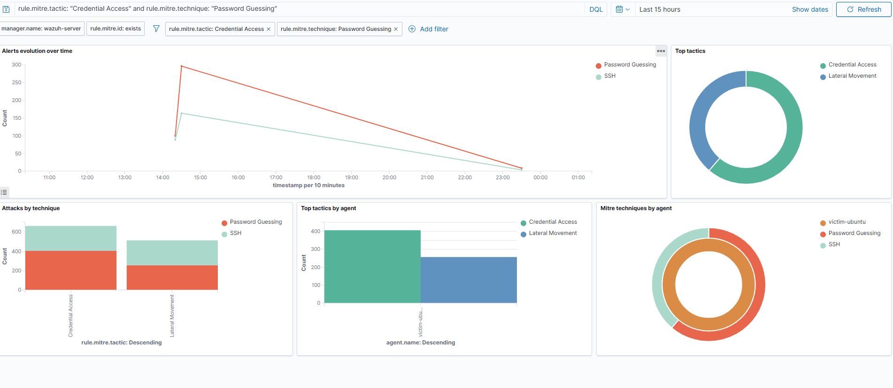

## Session 3: Mapping Detections to MITRE ATT&CK

The goal of this session was to stop looking at the attack as only a large number of failed login events and start viewing it from a SOC analyst perspective.

Instead of treating the alerts as separate log entries, I used the Wazuh **MITRE ATT&CK** module to understand what kind of attacker behavior was happening. Wazuh automatically maps detections to MITRE ATT&CK tactics and techniques, which helps connect raw events to a real attack phase.

## What the MITRE ATT&CK Module Shows

After opening the Wazuh **MITRE ATT&CK** dashboard and filtering the attack window, the brute-force activity from Session 1 was mapped under:

- **Tactic:** Credential Access
- **Technique:** T1110 - Brute Force

This means the failed login activity was not only normal authentication noise. It represented an attacker trying to gain valid credentials.

By clicking the technique, I was able to see the alerts connected to it. The detections from Session 1, including rules **5760**, **5710**, **5763**, **40111**, and related PAM/syslog alerts, were all grouped under the same technique.

This showed that different alerts were actually describing the same attacker behavior: repeated attempts to guess or obtain valid login credentials.

## Evidence Screenshot

The screenshot below shows the Wazuh MITRE ATT&CK dashboard filtered by Credential Access and Brute Force activity.

**Screenshot file:** `screenshots/03-mitre-matrix.png`

## From Events to Attacker Behavior

This was the main lesson of the session.

The same data can be understood in two different ways.

### Log-watcher view

> There are many failed authentication events on this host.

### Analyst view

> An adversary is in the Credential Access phase and is attempting T1110 - Brute Force against `victim-ubuntu` (`192.168.56.103`) from `192.168.56.101`.

The second view is much more useful for security analysis because it explains what the attacker is trying to achieve.

Instead of only counting failed logins, the analyst identifies the attacker’s objective. In this case, the objective was to gain valid credentials and access the victim machine.

This is the difference between simply watching logs and doing real analysis.

## Why MITRE ATT&CK Mapping Matters

MITRE ATT&CK mapping is useful because it gives alerts more context.

It helps analysts describe activity using a shared security language. For example, **T1110 - Brute Force** means the same thing across different tools, reports, and teams.

It also helps place alerts inside the attack lifecycle. Credential Access usually happens before actions like:

- Lateral Movement
- Persistence
- Privilege Escalation

This connects directly with Session 2, where the attacker created a backdoor account for persistence after gaining access.

MITRE ATT&CK also helps defenders understand which techniques are visible in their environment and which areas may still have detection gaps.

## Analyst Interpretation

Instead of reporting:

> There are many failed logins.

A better analyst report would be:

> Wazuh detected Credential Access activity mapped to MITRE ATT&CK T1110 - Brute Force. The attacker attempted repeated authentication against `victim-ubuntu` from `192.168.56.101`, indicating an attempt to obtain valid credentials.

## Key Takeaway

Mapping detections to MITRE ATT&CK turns raw log events into a clear description of attacker behavior.

The brute-force activity from Session 1 was not just a collection of failed logins. It represented the **Credential Access** phase of a possible intrusion.

This framing is important because it helps an analyst understand the attacker’s intent, communicate the risk clearly, and anticipate what the attacker may try next.

## Evidence

**Screenshot:** `screenshots/03-mitre-matrix.png`

**Tactic:** Credential Access  
**Technique:** T1110 - Brute Force  
**Target:** `victim-ubuntu` / `192.168.56.103`  
**Source:** `192.168.56.101`
