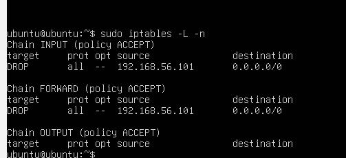

## Session 5: Active Response and Auto-Blocking the Attacker

In the earlier sessions I focused on detection: seeing what the attacker was doing and understanding how Wazuh caught it. In this session my goal was to close the loop and add automated response. Instead of just alerting when a brute force is detected, I wanted the SIEM to react to it directly by cutting off the attacker at the victim's firewall. This is what Wazuh calls **active response**, and it maps to the "response" step of the detect and respond cycle.

The scenario is a natural continuation of Session 1. When rule 5763 fires (aggregated SSH brute force, level 10, MITRE T1110), the manager tells the victim's agent to add an `iptables` DROP rule against the attacker's source IP. The block auto-expires after 180 seconds so I don't accidentally lock myself out during testing.

### How active response actually works

Worth understanding before wiring it up, because it clicks better once you see the mechanism: the manager decides, the agent enforces. When a matching rule fires on the manager, the manager sends a message to the target agent saying "run this response." The agent has a set of pre-shipped scripts (`firewall-drop.sh` in this case) that know how to add and remove firewall rules. So the manager is the brain, the agent's machine is the hand that reaches into its own iptables.

### Configuration

On the manager, I added an `<active-response>` block to `/var/ossec/etc/ossec.conf`:

```xml
<active-response>
  <command>firewall-drop</command>
  <location>local</location>
  <rules_id>5763</rules_id>
  <timeout>180</timeout>
</active-response>
```

Line by line:

- `<command>firewall-drop</command>`: the pre-defined Wazuh command that adds an iptables DROP for the offending source IP.
- `<location>local</location>`: run the response on the agent that generated the alert. In my setup that is the victim, which is exactly where the attacker's traffic needs to be blocked.
- `<rules_id>5763</rules_id>`: the trigger. When rule 5763 fires (aggregated SSH brute force), this response runs.
- `<timeout>180</timeout>`: how long the block stays before being auto-removed. Three minutes is enough to visibly stall an attack but short enough that if I fat-finger my own IP into the block during testing, I am not locked out for long.

### Why I chose rule 5763 as the trigger

The original guide binds active response to rule 5720. However my Session 1 investigation documented that rule 5720 does not fire in this ruleset because it is superseded by the 5760 to 5763 chain (see `wazuh-5720-investigation.md`). So I bound the response to rule 5763 instead, which is the level-10 aggregated brute-force alert that actually fires in my environment. Same detection meaning, same severity, same MITRE mapping (T1110), just adapted to what my ruleset really produces.

There is also a general principle here worth stating explicitly: active response should trigger on high-signal decision rules, not on raw-event rules. Something like rule 5700 (the base "sshd message" rule, level 0) fires on every SSH event including legitimate logins. If I had bound the response to it, my own SSH sessions would trigger the block and I would firewall myself out. Rule 5763 only fires after Wazuh's correlation engine has aggregated 8 failures from the same source, so it represents a *decision* that something bad is happening. That is the moment automation should kick in.

### The gotcha that cost me time

After adding the config and restarting the manager, the block did not fire. Hydra ran through all my password attempts without any visible slowdown, and `iptables -L -n` on the victim showed no DROP rules at all. I checked the config with:

```
sudo grep -B1 -A5 active-response /var/ossec/etc/ossec.conf
```

And the answer was staring at me:

```xml
<!--
<active-response>
  <command>firewall-drop</command>
  ...
</active-response>
-->
```

The whole block was inside an XML comment (`<!-- -->`). The default `ossec.conf` shipped it commented out as a template. When I added my own settings I edited the template but forgot to remove the surrounding comment markers, so the manager silently ignored it. Config valid, service started clean, response never fired. Removing the two comment lines and restarting the manager fixed it.

Worth noting because it is the kind of subtle mistake that produces zero errors and does absolutely nothing. Good analyst reflex learned: when active response doesn't fire, always grep the config to confirm the block is *actually* active and not just present as a comment.

### Verifying the block end to end

Once the config was live, I tested the full loop. From Kali:

```
hydra -l ubuntu -P password.txt ssh://192.168.56.103 -t 4 -W 1
```

After Hydra pushed enough failures to trigger rule 5763, on the victim `iptables` immediately picked up new DROP rules against Kali's IP:



*iptables on the victim after active response fired. DROP rules against 192.168.56.101 (Kali) appear in both the INPUT and FORWARD chains.*

To prove the DROP was actually stopping traffic (not just present on paper), I tested a fresh connection from Kali:

```
nc -vz -w 5 192.168.56.103 22
```

The output was:

```
(UNKNOWN) [192.168.56.103] 22 (ssh) : Connection timed out
```

This is the signature of an iptables DROP working correctly. A firewall REJECT would give "Connection refused" instantly. DROP silently discards packets, so Kali gets no response at all and the connection times out after nc's 5 second wait. From Kali's perspective the victim has vanished from the network.

After 180 seconds the block auto-removed itself, and `nc` to port 22 succeeded again. That confirms the full active-response lifecycle: trigger → block → wait → auto-unblock, all handled by Wazuh without human intervention.

### Why this matters

The lab now demonstrates more than detection. It demonstrates automated response, which is a category up from what most junior blue-team candidates can show. The whole loop runs without me touching anything after the attack starts:

1. Attack lands on the victim from Kali (192.168.56.101)
2. Victim's agent ships auth failures to the manager
3. Manager's correlation engine identifies the pattern as brute force (rule 5763, level 10, MITRE T1110)
4. Manager dispatches the `firewall-drop` command to the victim
5. Victim's agent adds an iptables DROP against 192.168.56.101
6. Kali's follow-up traffic is silently dropped
7. 180 seconds later, the DROP rule is automatically removed

**Detections:** rule 5763 · **Response:** firewall-drop · **MITRE ATT&CK:** T1110 (Brute Force)
