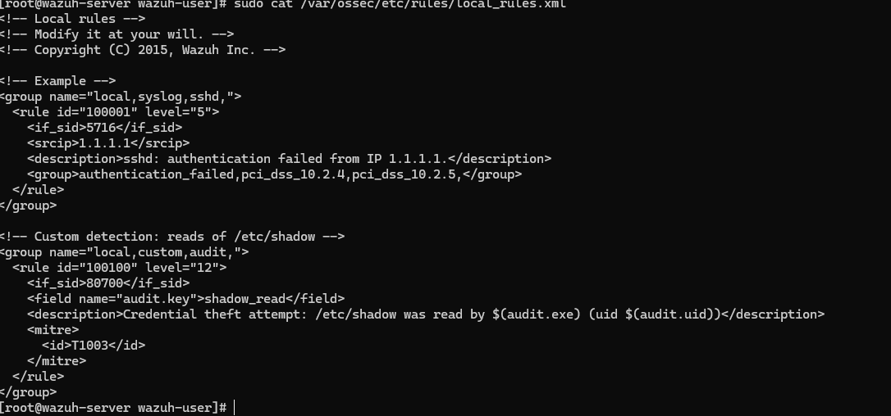
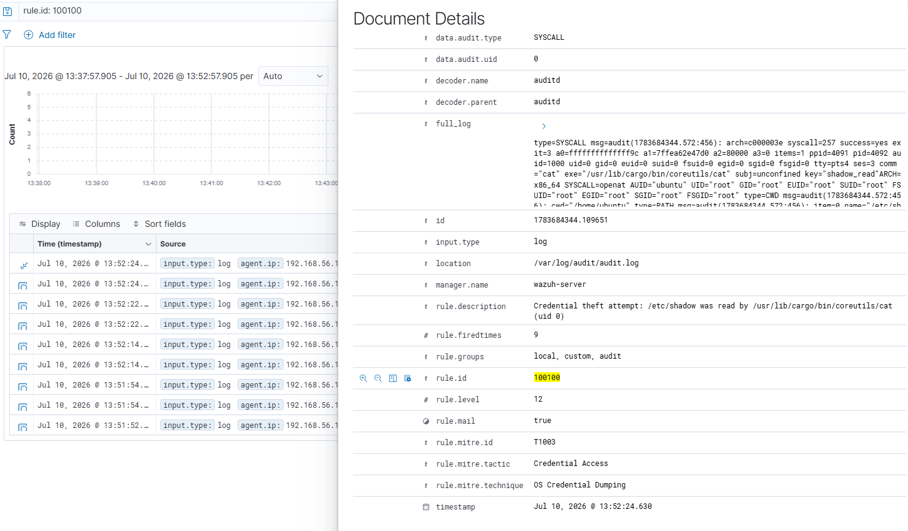

## Session 4: Detection Engineering and Writing a Custom Rule

The goal of this session was to move from *reading* Wazuh's detections to *writing my own*. Every session up to this point relied on rules that shipped with Wazuh. Here I wanted to fill a gap the default ruleset does not cover: alerting when someone reads `/etc/shadow`, which is a strong credential-theft signal (MITRE T1003, OS Credential Dumping).

By default the stock ruleset treats file reads as routine, so a `cat /etc/shadow` produces no meaningful alert. I wanted a level-12 alert with the executable and user identity embedded in the message.

### Why this needs auditd first

Linux does not log file *reads* by default, which is why the stock ruleset cannot catch this event even in principle. It has nothing to detect on. So before Wazuh could see the event, I had to make Linux itself generate one. That is what `auditd` (the Linux audit daemon) does.

On the victim I installed auditd and added a watch rule that logs any *read* of `/etc/shadow`, tagged with a key I chose:

```
sudo apt install auditd -y
sudo auditctl -w /etc/shadow -p r -k shadow_read
```

- `-w /etc/shadow`: watch this file
- `-p r`: trigger on read access
- `-k shadow_read`: tag every matching event with the key `shadow_read`, which will be my unique hook to match on later

Triggering it with `sudo cat /etc/shadow` produced an audit event containing the key. Confirmed with:

```
sudo ausearch -k shadow_read | tail -20
```

### Meeting wazuh-logtest properly

This is where `wazuh-logtest` earned its keep. I already used it in the 5720 investigation to *diagnose* rule chains. Here I used it to *build* a rule.

The move: paste one raw audit line into logtest and see exactly which fields Wazuh extracts. That tells me the exact field name my custom rule needs to match, so I do not guess and get it wrong.

On the manager I ran:

```
sudo /var/ossec/bin/wazuh-logtest
```

And pasted a raw SYSCALL line from the victim's `/var/log/audit/audit.log`. The output showed:

- **Phase 2 (decoding):** Wazuh decoded the event into structured fields including `audit.key: 'shadow_read'`, `audit.exe: '/usr/sbin/unix_chkpwd'`, `audit.uid: '0'`, `audit.command: 'unix_chkpwd'`.
- **Phase 3 (rules):** the default rule that fired was **80700** ("Audit: Messages grouped"), level 0, group `audit`.

Level 0 means Wazuh saw the event but decided it was not important enough to produce an alert. That is exactly the default behavior I wanted to override.

### Writing the rule

Custom rules live in `/var/ossec/etc/rules/local_rules.xml`. Never edit the default rule files, they get overwritten on updates.

The rule I wrote:

```xml
<group name="local,custom,audit,">
  <rule id="100100" level="12">
    <if_sid>80700</if_sid>
    <field name="audit.key">shadow_read</field>
    <description>Credential theft attempt: /etc/shadow was read by $(audit.exe) (uid $(audit.uid))</description>
    <mitre>
      <id>T1003</id>
    </mitre>
  </rule>
</group>
```



*The custom rule as it lives in `/var/ossec/etc/rules/local_rules.xml` on the manager, next to the shipped example rule.*

Line by line, because understanding *why* matters here as much as *what*:

- `<rule id="100100" level="12">`: ID 100100 is in the reserved 100000+ range for custom rules, so it cannot collide with Wazuh defaults. Level 12 puts it in the high-severity band, higher than the level-10 brute-force alerts. Credential theft deserves more attention than a login failure.
- `<if_sid>80700</if_sid>`: this rule only evaluates for events that already matched rule 80700, the base auditd rule. Chaining off 80700 means I inherit all the decoded audit fields for free.
- `<field name="audit.key">shadow_read</field>`: the actual match. Fire only when the decoded `audit.key` field equals `shadow_read`. That is why I set that specific auditctl key earlier: it is my unique identifier that says "this event was for the file I care about."
- `<description>...</description>`: the alert text. The `$(audit.exe)` and `$(audit.uid)` placeholders get substituted with the actual field values when the alert fires, so the message reads something like *"Credential theft attempt: /etc/shadow was read by /usr/bin/cat (uid 0)"*. Much more useful than a static message.
- `<mitre><id>T1003</id></mitre>`: MITRE ATT&CK tagging. T1003 is OS Credential Dumping. This is how the alert ends up on the MITRE dashboard under a new tactic (Credential Access), separate from the Session 1 brute force.

### Validating with wazuh-logtest before restarting anything

This is the professional move. `wazuh-logtest` lets me validate a new rule against a sample event without restarting the manager. If the rule has a syntax error or matches on the wrong field, I catch it here instead of restarting a production SIEM.

I pasted the same raw audit line into logtest, and Phase 3 showed:

```
id: '100100'
level: '12'
description: 'Credential theft attempt: /etc/shadow was read by /usr/sbin/unix_chkpwd (uid 0)'
groups: '['local', 'custom', 'audit']'
mitre.id: '['T1003']'
mitre.tactic: '['Credential Access']'
mitre.technique: '['OS Credential Dumping']'
Alert to be generated.
```

The rule fired at the correct level, the field substitution worked (real values, not placeholder strings), the groups were tagged correctly, and MITRE mapping came through. Everything wired up on the first try.

### The pipeline gap that cost me time

After restarting the manager and triggering `sudo cat /etc/shadow` on the victim, nothing appeared in the dashboard. The rule was correct but no alerts were showing.

I worked through it systematically:

1. **Did the victim generate the audit event?** `sudo ausearch -k shadow_read -ts recent` on the victim → yes, fresh events with the key.
2. **Did the alert land on the manager?** `sudo grep 100100 /var/ossec/logs/alerts/alerts.json` on the manager → empty.

So the event existed locally but was not reaching the manager. That narrowed it to the agent's log ingestion. Checked with:

```
sudo grep -A2 audit /var/ossec/etc/ossec.conf
```

on the victim, and it returned nothing. The Wazuh agent was not configured to read `/var/log/audit/audit.log` at all. Auditd was writing events, but no one was picking them up.

Fixed by adding a `<localfile>` block to the agent's `ossec.conf`:

```xml
<localfile>
  <log_format>audit</log_format>
  <location>/var/log/audit/audit.log</location>
</localfile>
```

Restarted the agent, triggered the read again, and the alert immediately appeared in the dashboard.

### The final alert



*Custom rule 100100 firing in Wazuh Discover. Level 12, dynamic description showing the reader (`/usr/lib/cargo/bin/coreutils/cat`) and user (uid 0), tagged with MITRE T1003 (OS Credential Dumping) under Credential Access. `firedtimes: 9` shows the rule has fired repeatedly, confirming it is stable and reproducible.*

### One tuning consideration for a real environment

In this lab the rule fires on every `sudo` command, because `sudo` internally invokes `unix_chkpwd` to check password expiry, and `unix_chkpwd` reads `/etc/shadow`. So the rule catches both real credential-theft attempts (`cat /etc/shadow`) and benign sudo internals.

In a production environment I would tune the rule to exclude `audit.exe: /usr/sbin/unix_chkpwd`, which produces harmless reads on every sudo invocation. The tuned rule would only fire on suspicious readers like `cat`, `less`, `head`, `grep`, or scripting interpreters accessing `/etc/shadow`. These are the real credential-theft signals. For the lab I left the rule broad because it produces the detection cleanly and the noise is a useful teaching example.

### What this session demonstrates

- Reading and understanding an existing rule chain (base rule → matching conditions → decoded fields).
- Configuring Linux audit rules to generate detection material that does not exist by default.
- Using `wazuh-logtest` to inspect decoder output and validate a rule *before* deploying it.
- Writing a custom, MITRE-tagged detection with dynamic field substitution.
- Diagnosing a silent pipeline gap (agent not ingesting the audit log) end to end.

**Detection:** rule 100100 (custom) · **Level:** 12 · **MITRE ATT&CK:** T1003 (OS Credential Dumping) · **Tactic:** Credential Access
